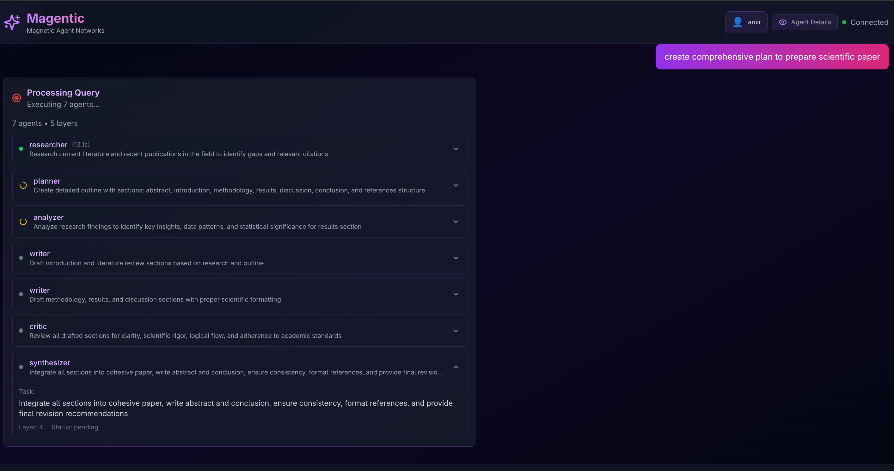

# Magentic

**Magnetic Agent Networks** - AI-powered meta-agent system with dynamic topology generation and parallel execution.



## Overview

Magentic is an intelligent multi-agent system that dynamically analyzes your queries and creates optimal networks of specialized AI agents to provide comprehensive answers. Unlike traditional chatbots, Magentic automatically scales from simple single-agent responses to complex multi-agent workflows based on query complexity.

## What Makes Magentic Unique

- **Dynamic Agent Planning**: AI meta-coordinator analyzes each query and generates the optimal agent topology
- **Parallel Execution**: Independent agents run simultaneously across execution layers for maximum efficiency
- **Intelligent Scaling**: Automatically uses minimal agents for simple queries, scales up for complex tasks
- **Web Search Integration**: Research agents can fetch current information from the web
- **Beautiful Web Interface**: Modern React UI with real-time execution visualization
- **User Authentication**: Secure accounts with conversation history and personal profiles

## Core Features

### Agent Orchestration
- 🎯 **8 Specialized Roles**: Researcher, Analyzer, Planner, Writer, Coder, Critic, Synthesizer, Coordinator
- ⚡ **Parallel Execution**: DAG-based layer execution with LangGraph
- 🔄 **Layer Synchronization**: Barrier nodes ensure reliable parallel execution
- 💾 **State Management**: Checkpointing and crash recovery with resumable execution
- 🗨️ **Conversation History**: Agents receive context from previous conversation steps

### Web Interface
- 💬 **Interactive Chat**: Clean, modern chat interface with gradient design
- 🔐 **User Authentication**: Login/Register system with secure password hashing
- 👤 **User Profiles**: Personal profiles with avatars, stats, and conversation history
- 🎭 **Guest Mode**: Try the system without registration
- 💾 **Persistent History**: All conversations saved to database
- ⚡ **Real-time Updates**: WebSocket-based live progress streaming
- 📊 **Expandable Details**: Click any agent to see execution info and timing
- 🎨 **Markdown Support**: Beautiful rendering with syntax highlighting
- 👁️ **Toggle View**: Show/hide execution details

### Technical Capabilities
- 🔍 **Web Search**: DuckDuckGo integration for current information
- 📊 **Observability**: Phoenix dashboard for LLM tracing and debugging
- 🐛 **Debug Mode**: Optional state visualization for troubleshooting
- 🎭 **Multi-LLM Support**: Works with Ollama (local), OpenAI, and Claude
- ⚙️ **Configurable**: Customize output limits, temperature, and more

## Tech Stack

**Backend:**
- **FastAPI** - Modern async web framework with WebSocket support
- **SQLAlchemy** - Database ORM with Alembic migrations
- **LangGraph** - Agent orchestration and execution
- **Passlib + bcrypt** - Secure password hashing
- **SQLite** - Local database with connection pooling

**Frontend:**
- **React 18** - Modern UI library
- **Vite** - Lightning-fast build tool with HMR
- **Tailwind CSS** - Utility-first styling with custom animations
- **react-markdown** - Markdown rendering with GitHub-flavored markdown
- **rehype-highlight** - Syntax highlighting for code blocks
- **Lucide React** - Beautiful icon library

**LLM Support:**
- **Ollama** - Local, private, free (llama3.2, mistral, etc.)
- **OpenAI** - GPT-4, GPT-3.5
- **Claude** - Claude 3.5 Sonnet, Opus

## Quick Start

### Automated Setup (Recommended)

Run the setup script to install everything automatically:

```bash
./setup.sh
```

This will:
- Create virtual environment
- Install all Python dependencies
- Set up the database with migrations
- Install frontend dependencies
- Create .env file from template

After setup completes, configure your LLM in `.env` and start the servers.

### Manual Setup

<details>
<summary>Click to expand manual setup instructions</summary>

#### 1. Install Dependencies

```bash
# Create virtual environment
python3 -m venv .venv
source .venv/bin/activate  # On Windows: .venv\Scripts\activate

# Install Python packages
pip install -r requirements.txt

# Install frontend dependencies
cd frontend
npm install
cd ..
```

#### 2. Setup Database

```bash
# Run migrations to create database
alembic upgrade head

# Optional: Create a demo user (username: demo, password: demo123)
python init_db.py --demo
```

#### 3. Configure LLM

Copy `.env.example` to `.env` and configure your LLM:

```bash
# For Ollama (default, runs locally)
LLM_PROVIDER=ollama
OLLAMA_MODEL=llama3.2:1b

# For OpenAI
# LLM_PROVIDER=openai
# OPENAI_API_KEY=your-key-here
# OPENAI_MODEL=gpt-4o

# For Claude
# LLM_PROVIDER=claude
# ANTHROPIC_API_KEY=your-key-here
# ANTHROPIC_MODEL=claude-3-5-sonnet-20241022
```

**LLM Options:**
- **Ollama** (default, free, private) - Install from https://ollama.com then run `ollama pull llama3.2:1b`
- **OpenAI** - Get API key from https://platform.openai.com
- **Claude** - Get API key from https://console.anthropic.com

</details>

### Start the Application

**Terminal 1 - Backend:**
```bash
python -m src.run_api
```

**Terminal 2 - Frontend:**
```bash
cd frontend
npm run dev
```

**Open Browser:** `http://localhost:3000`

On first visit, you'll see a login modal with options to:
- **Register** - Create a new account
- **Login** - Use existing account
- **Continue as Guest** - No registration needed

## Usage

### Example Queries

Try these to see the agent system in action:

- **Simple**: "What is Python?" → Uses 1 analyzer agent
- **Medium**: "Explain how neural networks work" → Uses 1-2 agents
- **Complex**: "Compare React vs Vue and recommend which to use for a large e-commerce site" → Uses multiple researchers + synthesizer

### How It Works

1. **Query Analysis**: Meta-coordinator analyzes your question
2. **Agent Planning**: Generates optimal network of specialized agents
3. **Parallel Execution**: Agents run simultaneously in layers
4. **Layer Barriers**: Ensures all agents in a layer complete before next layer starts
5. **Synthesis**: Final agent combines results into comprehensive answer

### CLI Mode

For command-line usage without the web UI:

```bash
python app.py
```

## Configuration

Edit `.env` file to customize behavior:

**System Settings:**
```bash
MAX_PARALLEL_AGENTS=3        # Concurrent agents (2-5 recommended)
LLM_TEMPERATURE=0.7          # 0.0 (precise) to 2.0 (creative)
```

**Ollama Settings:**
```bash
OLLAMA_BASE_URL=http://localhost:11434
OLLAMA_MODEL=llama3.2:1b     # or llama3.1, mistral, etc.
```

**OpenAI Settings:**
```bash
OPENAI_MODEL=gpt-4o          # or gpt-4-turbo, gpt-3.5-turbo
OPENAI_API_KEY=your-key-here
```

**Claude Settings:**
```bash
ANTHROPIC_MODEL=claude-3-5-sonnet-20241022
ANTHROPIC_API_KEY=your-key-here
```

**Debug & Display:**
```bash
DEBUG_STATE=false            # Set to true for state visualization
UI_DISPLAY_LIMIT=200         # Character limit for output (min: 50)
```

## Database Management

```bash
# Initialize database
alembic upgrade head

# Create demo user (username: demo, password: demo123)
python init_db.py --demo

# Reset database (⚠️ DELETES ALL DATA!)
python reset_db.py              # With confirmation prompt
python reset_db.py --demo       # Reset and create demo user
python reset_db.py --confirm    # Skip confirmation

# Check database status
alembic current

# Create new migration after model changes
alembic revision --autogenerate -m "Description"
```

## Documentation

- [Project Overview](docs/PROJECT_OVERVIEW.md) - Comprehensive project documentation
- [Architecture Guide](docs/ARCHITECTURE.md) - Detailed system architecture
- [Layer Barriers](docs/LAYER_BARRIERS.md) - Execution synchronization system
- [Authentication Guide](docs/AUTHENTICATION.md) - User registration and profiles
- [Web UI Guide](frontend/README.md) - Frontend documentation
- [Database Migrations](alembic/README.md) - Alembic migration guide
- [Changelog](CHANGELOG.md) - Version history and updates

## Phoenix Dashboard (Optional)

For real-time LLM tracing and debugging, Phoenix is automatically available at:
- **URL**: http://localhost:6006
- **Features**: Request tracing, token usage, performance metrics

## Architecture

Magentic uses a sophisticated multi-layer architecture:

1. **Meta-Coordinator**: LLM-based planner that analyzes queries and generates agent topologies
2. **Agent Network**: Dynamic DAG of specialized agents executing in parallel layers
3. **Layer Barriers**: Synchronization nodes ensuring reliable parallel execution
4. **State Management**: LangGraph-based state with checkpointing and recovery
5. **Web Interface**: React frontend with WebSocket streaming for real-time updates

## Agent Roles

- **Researcher**: Searches the web for current information
- **Analyzer**: Analyzes data, explains concepts, answers questions
- **Planner**: Creates step-by-step plans and strategies
- **Writer**: Writes articles, stories, documentation
- **Coder**: Generates and explains code
- **Critic**: Reviews and improves content
- **Synthesizer**: Combines multiple inputs into coherent output
- **Coordinator**: Routes and delegates complex tasks

## Contributing

Contributions are welcome! Please feel free to submit issues and pull requests.

## License

MIT License - see [LICENSE](LICENSE)

## Support

For issues, questions, or feature requests, please open an issue on GitHub.
