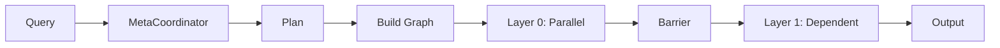

# Magentic Architecture

> 🖼️ See [architecture_diagram.svg](architecture_diagram.svg) for visual overview.

## Overview

Magentic is a production-ready multi-agent orchestration system built on **LangGraph**. It dynamically generates agent networks per query, executes them in parallel layers with barrier synchronization, and provides full state management with persistence.

```
User Query → Meta-Coordinator → Dynamic Agent Plan → LangGraph Execution → Output
                   ↓
            Analyzes complexity, selects roles, defines dependencies
```

## Core Technologies

| Technology | Purpose | Key Features |
|------------|---------|---------------|
| **LangGraph** | Agent Orchestration | DAG execution, state reducers, checkpointing, crash recovery |
| **MCP Gateway** | Tool Integration | Docker-based Model Context Protocol server, extensible tools |
| **Qdrant/ChromaDB** | RAG Vector Store | Semantic search, document retrieval, embedding storage |
| **SQLAlchemy** | Persistence | Conversation history, user accounts, session management |
| **FastAPI** | API Layer | Async endpoints, WebSocket streaming, auth middleware |
| **React + Zustand** | Frontend | Real-time UI, state management, execution visualization |

## System Layers

| Layer | Components | Purpose |
|-------|------------|---------|
| **Frontend** | React, WebSocket | Real-time UI, agent visualization |
| **API** | FastAPI | REST + WebSocket endpoints |
| **Coordination** | MetaCoordinator | Query analysis, plan generation |
| **Execution** | LangGraph | State management, parallel execution |
| **Agents** | MetaAgentSystem | Agent orchestration, tool access |
| **RAG** | Qdrant/Chroma | Vector search, document retrieval |

## Execution Flow



## Key Concepts

### Dynamic Topology
Each query gets a unique agent configuration:
- "Hi" → 1 agent
- "Compare X vs Y" → 2 researchers + 1 synthesizer

### Layer Barriers
Synchronization points ensuring all agents in layer N complete before layer N+1 starts.

### Parallel Execution
Agents without dependencies run concurrently within the same layer.

## LangGraph Integration

Magentic uses LangGraph for robust agent orchestration:

```python
# State definition with typed reducers
class MagenticState(TypedDict):
    query: str
    agent_outputs: Annotated[Dict[str, str], merge_dicts]
    conversation_history: Annotated[List[Dict], operator.add]
    final_output: str
```

**Key Features:**
- **Checkpointing**: Resume interrupted executions
- **State Reducers**: Merge parallel agent outputs safely
- **Barrier Nodes**: Synchronize layer completion
- **Dynamic Graphs**: Build topology per query

## MCP Gateway

Model Context Protocol integration via Docker:

```
┌─────────────┐     ┌─────────────┐     ┌─────────────┐
│   Agent     │────▶│ MCP Gateway │────▶│ MCP Servers │
│  Executor   │     │  (Docker)   │     │ filesystem  │
└─────────────┘     └─────────────┘     │ fetch, etc  │
                                        └─────────────┘
```

Add custom MCP servers in `docker/mcp-gateway/config.json`.

## RAG System

Retrieval-Augmented Generation with **active** knowledge injection:

### Active RAG (Automatic)

When RAG is enabled, the system automatically injects relevant context into the planning phase:

```
User Query → RAGService.get_relevant_context_for_planning() → Enriched Query
                              ↓
                   Knowledge Base Search (top 3 docs, min 0.5 score)
                              ↓
                   MetaCoordinator receives enriched context
                              ↓
                   Better informed agent planning
```

**Active RAG Features:**
- Auto-searches knowledge base on every query
- Injects relevant context before planning (not just execution)
- Configurable relevance threshold (default: 0.5)
- Coordinator makes better decisions with domain context

### Passive RAG (Tool-based)

Agents can also explicitly search via `search_knowledge_base` tool during execution.

### Vector Stores

- **Qdrant**: Production-ready, supports memory or server mode
- **ChromaDB**: Lightweight alternative for local development
- **Embeddings**: Ollama (local), OpenAI, or Voyage AI

## Persistence Layer

```
┌──────────────┐     ┌──────────────┐     ┌──────────────┐
│   FastAPI    │────▶│  SQLAlchemy  │────▶│    SQLite    │
│   Endpoints  │     │     ORM      │     │  magentic.db │
└──────────────┘     └──────────────┘     └──────────────┘
```

**Persisted Data:**
- User accounts (bcrypt hashed passwords)
- Conversation history with messages
- Execution metadata and token usage
- User preferences and profiles

## Directory Structure

```
src/
├── agents/          # Agent system, executor, LLM factory, token tracking
├── coordinator/     # Meta-planner, validators, prompts
├── execution/       # LangGraph builder, state, barrier nodes
├── services/        # MCP client, RAG service
├── tools/           # Tool manager, web search
└── api.py           # FastAPI + WebSocket endpoints
frontend/src/
├── components/      # Chat, AgentStep, ExecutionSummary
├── hooks/           # useWebSocket for real-time updates
├── store/           # Zustand state management
└── contexts/        # Auth context
docker/
├── mcp-gateway/     # MCP server configuration
└── docker-compose.yml
```
